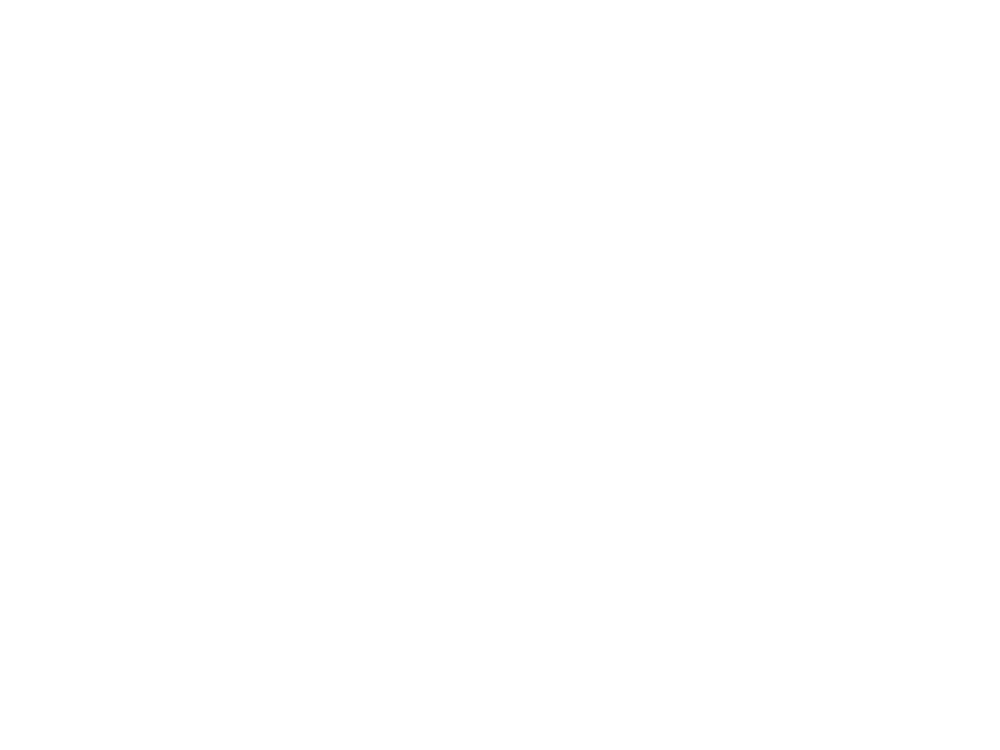

  

# Prefix Calculator

Works with positive, negative numbers, also with binary and hexadecimal numbers and with Fractions.
Roman numerals are not implemented yet.

## How-to build

Download or clone this code and then run GenerateProject.bat file to generate vs solution.

## Future

- Graphical User Interface (GUI)
- [✓] More mathematical operations 
- [✓] Constants 
- More number representations
- Save expressions, results
- [✓] Currency
- Any suggestions?

## Documentation

**NOT AVAILABLE**

Please use **'info'** in the calculator
